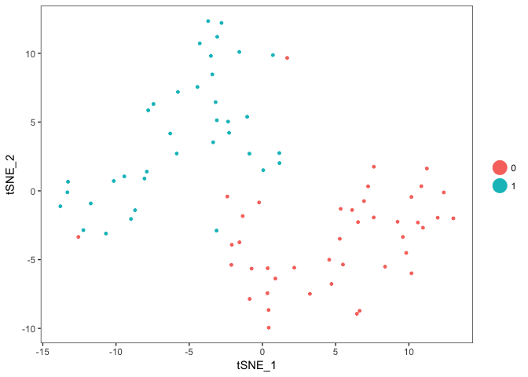

<!-- README.md is generated from README.Rmd. Please edit that file -->
scRobustPCA
===========

Performs robust PCA with modified PCs on Seurat objects for scRNA-Seq dimensionality reduction.

Installation
------------

You can install scRobustPCA from github with:

``` r
# install.packages("devtools")
devtools::install_github("gmstanle/scRobustPCA")
```

Working example on 80 PBMCs
===========================

Intended only to demonstrate a functional workflow. `pbmc_small` is a subsetted dataset with 80 cells and 230 genes included in the `Seurat` package.

Calculate rPCA
--------------

``` r
require(Seurat)
#> Loading required package: Seurat
#> Loading required package: ggplot2
#> Loading required package: cowplot
#> 
#> Attaching package: 'cowplot'
#> The following object is masked from 'package:ggplot2':
#> 
#>     ggsave
#> Loading required package: Matrix
require(scRobustPCA)
#> Loading required package: scRobustPCA
pcs.use=1:5
pbmc_small <- FindVariableGenes(pbmc_small, do.plot = F) # optional
pbmc_small <- RunRobPCA(pbmc_small, npcs=max(pcs.use), use.modified.pcscores = T)
#> [1] "Running rPCA"
#> [1] "PC1"       "PC2"       "PC3"       "PC4"       "PC5"       "cell.name"
#> [1] "PC1" "PC2" "PC3" "PC4" "PC5"
#> [1] "Calculating modified PCs"
#> [1] "Adding modified PCs to Seurat object"
#> [1] "Adding rPCA loadings to Seurat object"
```

Plot pairwise combinations of PCs
---------------------------------

``` r
pairs(GetCellEmbeddings(pbmc_small, reduction.type = 'rpca'))
```


Calculate TSNE
--------------

``` r
pbmc_small <- RunTSNE(pbmc_small, reduction.use = 'rpca', dims.use = pcs.use,perplexity=10)
```

Cluster cells
-------------

``` r
pbmc_small <- FindClusters(pbmc_small, reduction.type = 'rpca', print.output = F)
TSNEPlot(pbmc_small)
```


